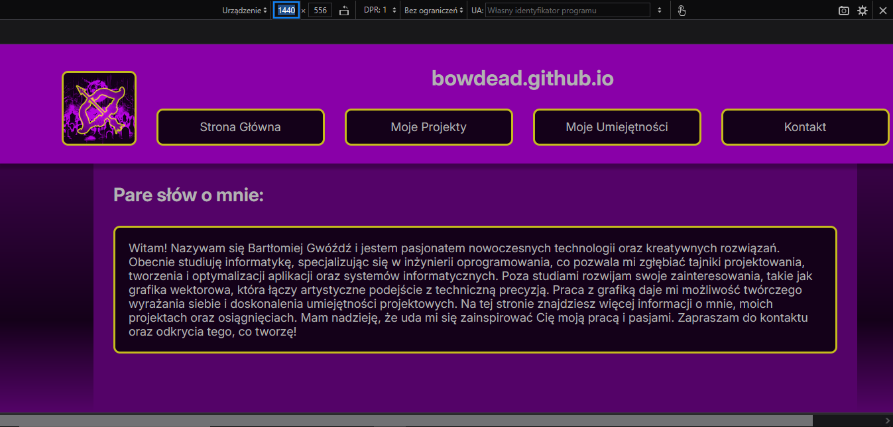
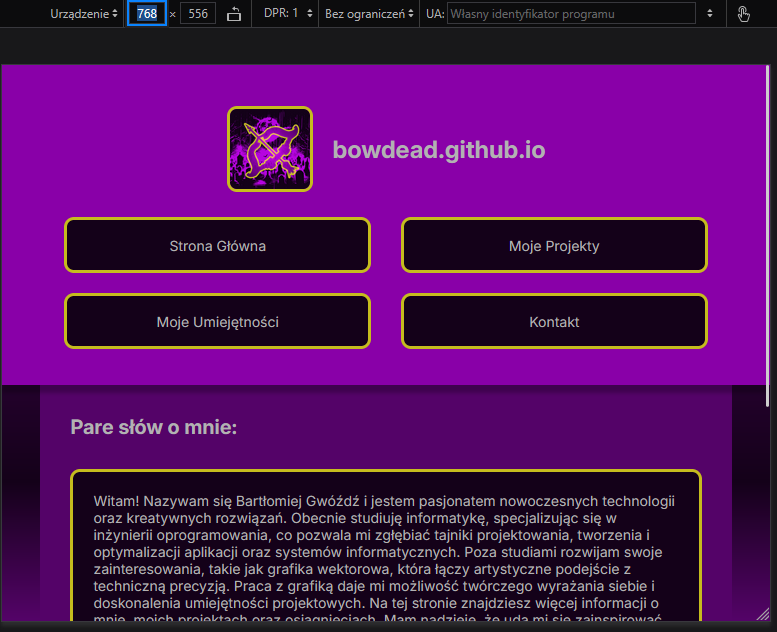
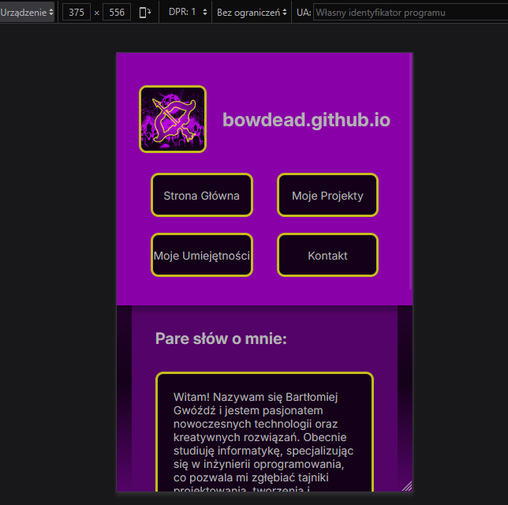

# Dokumentacja portfolio internetowego stworzonego na potrzeby projektu z przedmiotu: "Projektowanie interfejsów użytkownika II" 

## Wstęp
Poniższy dokument opisuje strukturę portfolio internetowego stworzonego w ramach projektu z przedmiotu Projektowanie interfejsów urzytkownika II,
wykorzystane technologie przy tworzeniu strony oraz testy strony internetowej na 5 różnych przeglądarkach (Chrome, Edge, Safari, Firefox i Opera) w trzech rozdzielczościach na każdej przeglądarce.

---
## Adres strony

#### https://bowdead.github.io/BGportfolio/
---

## Opis struktury serwisu
**Strona internetowa składa się z następujących podstron:**
1. **HOME** - zawiera krótki opis na mój temat
2. **LIST** – zawiera listę projektów, w których brałem udział, lista pobierana jest z wewnętrznego jsona, podstrona wykorzystuje także paginację
3. **DETAILS** – zawiera szczegółowe informacje na temat projektu wybranego na podstronie "LIST"
4. **Stopka** – zawiera informacje o prawach autorskich

**Każda podstrona składa się z następujących sekcji:**
1. **Nagłówek** – zawiera logo, nazwę strony oraz menu nawigacyjne
2. **Content** – posiada różną treść w zależności na której podstronie znajduje się użytkownik
3. **Stopka** – zawiera informacje o prawach autorskich

---

## Opis technologii zastosowanych przy tworzeniu serwisu
### Frontend
- **HTML** - do stworzenia struktury strony
- **CSS** – do  stylizacji strony
- **JavaScript** – do obsługi logiki strony, w tym paginacji, oraz tworzenia komponentów
- **GitHub Pages** – platforma hostingowa dla strony internetowej

### Wersjonowanie kodu
- **Git** – system kontroli wersji pozwalający na śledzenie zmian w kodzie oraz współpracę nad projektem.
- **GitHub** – platforma do przechowywania kodu, zarządzania wersjami, oraz współpracy zespołowej.

---

## Testy
### Zakres testów
Testy wizualne zostły przeprowadzone w następujących przeglądarkach:
- Chrome
- Edge
- Safari
- Firefox
- Opera

### Testowane rozdzielczości
1. **Desktop:** 1440px szerokości
2. **Tablet:** 768px szerokości
3. **Smartfon:** 375px szerokości

#### Zrzuty ekranu dla testów
### Google
##### DESKTOP

##### TABLET

##### MOBILE

### Opera
##### DESKTOP

##### TABLET

##### MOBILE

### Firefox
##### DESKTOP

##### TABLET

##### MOBILE

### Edge
##### DESKTOP

##### TABLET

##### MOBILE

### Safari
##### DESKTOP

##### TABLET

##### MOBILE

#### Uwagi
- W przypdaku testów na safari kolory zdefiniowane w css odbiegały od reszty
- W mojej wersji safari (Windows) nie mogłem znaleść trybu responsywnego
- Na wszystkich przeglądarkach strona działała poprawnie
- Scrypty napisane w javascript działały na wszystkich przeglądarkach
---

## Podsumowanie
Po testach responsywności i działania na przeglądarkach: Google Chrome, Opera, Firefox, Safari i Edge. Strona spełnia swoje zadanie i działa
w każdej z wyżej wymienionych przeglądarek internetowych. Strona ma prosty design spełniający wymagania projektowe, zdefiniowane style dla trzech
zakresów rozdzielczości oraz obsługuje paginację i komponenty napisane w javascript.
